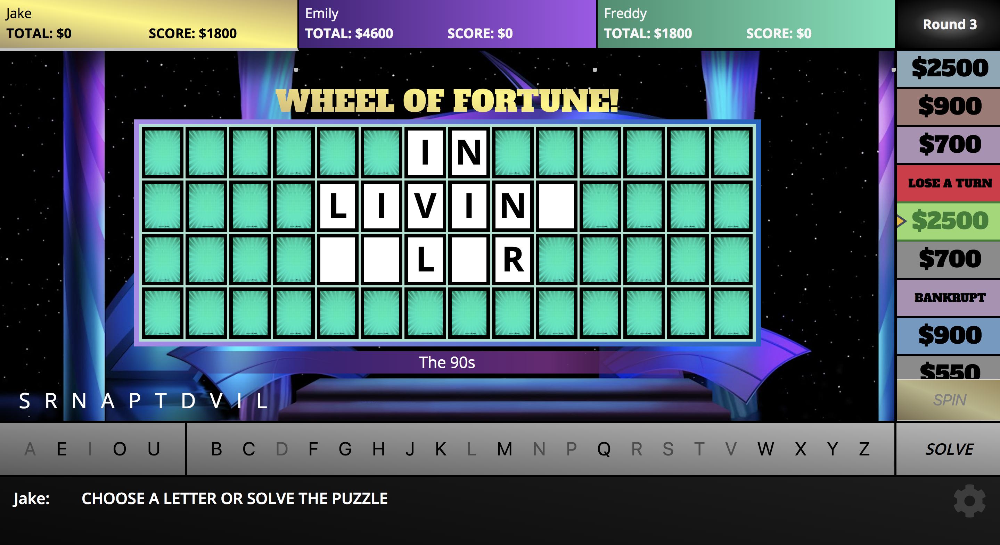

# Wheel-of-Fortune - Turing Mod 2 OOP Project

Enjoy a round of this three-player recreation of the classic Wheel of Fortune game. Spin the wheel and 
solve the puzzles to compete for a chance to spin the bonus wheel and take home massive prizes!

 
## Background / About
  The goal of this project was to utilize Object Oriented Programming to build a fully functional wheel of fortune game. The game supports three players and guides you through each puzzle with wheel spins, vowel purchases, consonant guesses, and solve attempts. The winner through 4 rounds participates in single-player bonus round. For more on how to play, checkout the instructions in-game or read this [article](http://game-shows.chris-place.com/shows/wheel-of-fortune/how-to-play.htm.).

## See it Live

[Wheel of Fortune]() on Github Pages.

## Specs

* Built with Javascript and jQuery.
* Styled with SASS/SCSS
* Tested with Mocha/Chai

## Next Steps

## Screenshots

## Setup

Clone the repo

## Original Assignment

[Wheel of Fortune](http://frontend.turing.io/projects/wheel-of-fortune.html) from the Turing School of Software & Design
  
